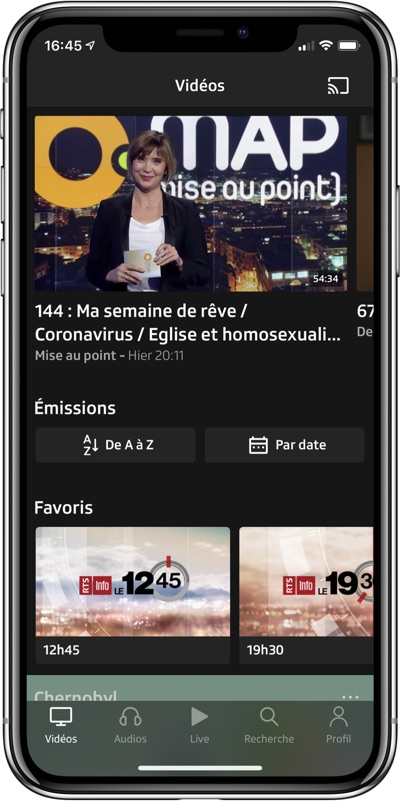
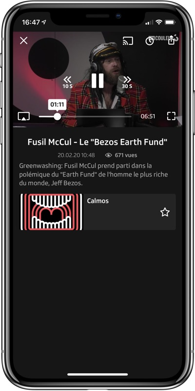
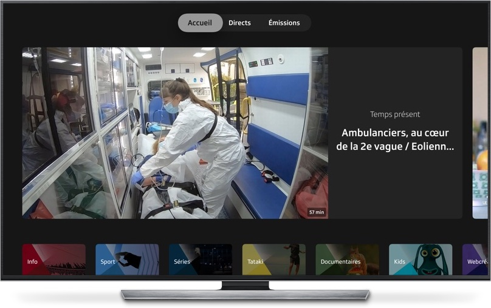

## About

Play SRG is the [SRG SSR (Swiss Broadcasting Corporation)](https://www.srgssr.ch/en/who-we-are/organisation/) audio and video platform, provided as a distinct service for each of its business units ([RSI](https://www.rsi.ch), [RTR](https://www.rtr.ch), [RTS](https://www.rts.ch), [SRF](https://www.srf.ch) and [SWI](https://www.swissinfo.ch)). This repository contains the source code of the Play SRG applications for iOS and tvOS.

The Play platform is more generally available on the web and on Android phones:

| Platform | Play RSI | Play RTR | Play RTS | Play SRF | Play SWI |
|:-- |:--:|:--:|:--:|:--:|:--:|
| iOS / tvOS | [📱📺](https://itunes.apple.com/ch/app/play-rsi/id920753497) | [📱📺](https://itunes.apple.com/ch/app/play-rtr/id920754925) | [📱📺](https://itunes.apple.com/ch/app/play-rts/id920754415) | [📱📺](https://itunes.apple.com/ch/app/play-srf/id638194352) | [📱📺](https://itunes.apple.com/ch/app/play-swi/id920785201) |
| Android | [🤖](https://play.google.com/store/apps/details?id=ch.rsi.player) | [🤖](https://play.google.com/store/apps/details?id=ch.rtr.player) | [🤖](https://play.google.com/store/apps/details?id=ch.rts.player) | [🤖](https://play.google.com/store/apps/details?id=ch.srf.mobile.srfplayer) | [🤖](https://play.google.com/store/apps/details?id=ch.swissinfo.player) |
| Web | [🖥](https://www.rsi.ch/play) | [🖥](https://www.rtr.ch/play) | [🖥](https://www.rts.ch/play) | [🖥](https://www.srf.ch/play) | [🖥](https://www.swissinfo.ch/play) |

 


## Features

The application provides a rich set of functionalities, among which:

* Access to to our content, whether its is broadcast on TV, radio or online. 
* An audio mini player (iOS only).
* Subscriptions with push notifications (iOS only).
* Resume playback and continuous playback.
* Favorites.
* Downloads (iOS only).
* AirPlay and Google Cast support (iOS only).
* VoiceOver and larger font support for better accessibility.
* Handoff support (iOS only).

Depending on the business unit, some functionalities might not be available (e.g. SWI has no radio content).

## Compatibility

The project runs on iOS 12, tvOS 14 and above and must be opened with the latest Xcode version.

## Contributing

If you want to contribute to the project, have a look at our [contributing guide](CONTRIBUTING.md).

## Required tools

Building the project requires command-line tools for icon generation, easily installed with [Homebrew](https://brew.sh/):
	
	brew install imagemagick ghostscript
	brew install jq
	
Some project dependencies are retrieved using [Carthage](https://github.com/Carthage/Carthage) and [CocoaPods](https://cocoapods.org/). Be sure that these tools are available on your system.

## Building the project

A [Makefile](../Makefile) provides several targets to prepare project dependencies. The available targets can be listed by running the following command from the project root folder:

```
make help
```

Commands are available both for internal use (proprietary builds) and for wider use (public builds).

### Private settings

Private project settings (keys, tokens, etc.) are stored [in a private repository](https://github.com/SRGSSR/playsrg-configuration-ios), pulled under the `Configuration` directory when running `make setup` (or any other target depending on it). The SHA-1 of the configuration commit which is used is explicitly provided in the `Makefile`. Settings are therefore versioned alongside the project, providing for reproducible builds.

If you need to make changes to the settings:

1. Perform the required changes in the `Configuration` directory (and in the project as well if needed).
1. Switch to the `Configuration` directory and commit changes there.
1. Update the [Makefile](../Makefile) `CONFIGURATION_COMMIT_SHA1` variable to point at the configuration commit to use.
1. Push all commits when you are ready.

If you are part of the SRG SSR organization be sure to setup the project first:

```
make setup
```

### Running the project

Dependencies must retrieve and built first:

```
make bootstrap
```

Then open Xcode to build and run the project.

## Releasing binaries

The proprietary project uses [fastlane](https://fastlane.tools/) for releasing binaries, either for internal purposes or for the AppStore.

## Specifications

Follow the links below for feature specifications and technical details:

* [Remote configuration](REMOTE_CONFIGURATION.md).
* [URL schemes](URL_SCHEMES.md)