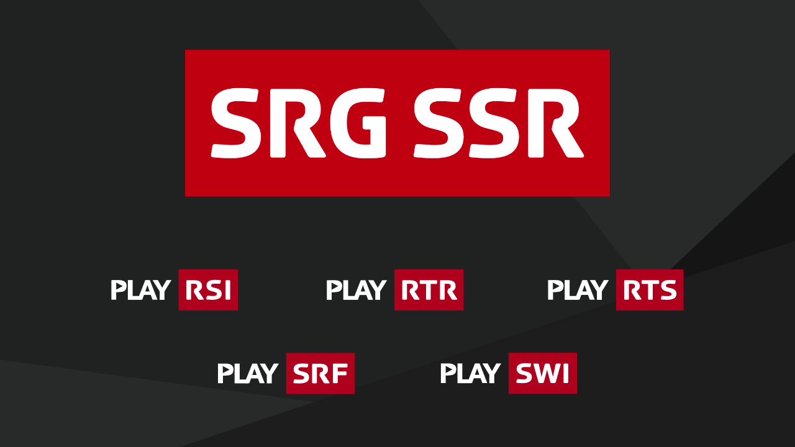

## About

Play SRG is the [SRG SSR (Swiss Broadcasting Corporation)](https://www.srgssr.ch/en/who-we-are/organisation/) audio and video platform, provided as a distinct service for each of its business units ([RSI](https://www.rsi.ch), [RTR](https://www.rtr.ch), [RTS](https://www.rts.ch), [SRF](https://www.srf.ch) and [SWI](https://www.swissinfo.ch)). This repository contains the source code of the Play SRG applications for iOS and tvOS.

The Play platform is more generally available on the web, on Android phones and devices running Android TV:

| Platform | Play RSI | Play RTR | Play RTS | Play SRF | Play SWI |
|:-- |:--:|:--:|:--:|:--:|:--:|
| iOS / tvOS | [🍎📱📺🚗](https://itunes.apple.com/ch/app/play-rsi/id920753497) | [🍎📱📺🚗](https://itunes.apple.com/ch/app/play-rtr/id920754925) | [🍎📱📺🚗](https://itunes.apple.com/ch/app/play-rts/id920754415) | [🍎📱📺🚗](https://itunes.apple.com/ch/app/play-srf/id638194352) | |
| Android / Android TV | [🤖📱📺🚗](https://play.google.com/store/apps/details?id=ch.rsi.player) | [🤖📱📺🚗](https://play.google.com/store/apps/details?id=ch.rtr.player) | [🤖📱📺🚗](https://play.google.com/store/apps/details?id=ch.rts.player) | [🤖📱📺🚗](https://play.google.com/store/apps/details?id=ch.srf.mobile.srfplayer) | |
| Web | [🖥📱💻](https://www.rsi.ch/play) | [🖥📱💻](https://www.rtr.ch/play) | [🖥📱💻](https://www.rts.ch/play) | [🖥📱💻](https://www.srf.ch/play) | [🖥📱💻](https://www.swissinfo.ch/play) |


## Features

The application provides a rich set of functionalities, among which:

* Access to our content, whether it is broadcast on TV, radio or online. 
* A TV guide.
* An audio mini player (iOS only).
* Subscriptions with push notifications (iOS only).
* Resume playback and continuous playback.
* Favorites.
* Downloads (iOS only).
* AirPlay, Google Cast and CarPlay support (iOS only).
* VoiceOver and larger font support for better accessibility.
* Handoff support (iOS only).

Depending on the business unit some functionalities might not be available (e.g. SWI has no radio content).

## Compatibility

The project runs on iOS 14.1, tvOS 14 and above and must be opened with the latest Xcode version.

## Required tools

- Building the project requires command-line tools for icon generation, easily installed with [Homebrew](https://brew.sh/):

	```
	brew install imagemagick ghostscript jq
	```

- Some project dependencies are retrieved using [CocoaPods](https://cocoapods.org/). Be sure that this tool is available on your system:

	```
	which pod
	pod --version
	```
	
	If not, install it:
	
	```
	brew install cocoapods
	```

## Building the project

A [Makefile](../Makefile) provides several targets to prepare project dependencies. The available targets can be listed by running the following command from the project root folder:

```
make help
```

### Project setup

After checking out the project run:

```
make setup
```

to setup the project and its dependencies.

### Private settings

Private project settings (keys, tokens, etc.) are stored [in a private repository](https://github.com/SRGSSR/playsrg-configuration-ios), pulled under the `Configuration` directory when running `make setup` (or any other target depending on it). The SHA-1 of the configuration commit which is used is explicitly provided in the `Makefile`. Settings are therefore versioned alongside the project, providing for reproducible builds.

If you need to make changes to the settings:

1. Perform the required changes in the `Configuration` directory (and in the project as well if needed).
1. Switch to the `Configuration` directory and commit changes there.
1. Update the [Makefile](../Makefile) `CONFIGURATION_COMMIT_SHA1` variable to point at the configuration commit to use.
1. Push all commits when you are ready.

The project can be built without private settings but some features might not be available (e.g. push notifications) or configured in a different way.

### Running the project

Simply open the project with Xcode and wait until all dependencies have been retrieved. Then build and run the project.

### Quality checks

Checking quality, the project requires command-line tools:

```
brew install swiftlint swiftformat shellcheck yamllint
```

For `rubocop`, be sure that this tool is available on your system, or execute:

```
bundle install --path vendor/bundle
```

When all command-line tools are installed, check code quality can be done using:

```
make check-quality
```

This ensures that Swift files, and scripts are conform to common best practices.

### Licenses for libraries used in the project

In the iOS application settings, licenses of libraries used in the project can be consulted. To build the list, running an iOS target requires [LicensePlist](https://github.com/mono0926/LicensePlist).

```
brew install licenseplist
```

### SRGSSR project

Some links to [internal Jira SRGSSR instance](https://srgssr-ch.atlassian.net) can be found in commit messages, branch names or pull request titles.

### Git hooks installation

Project git hooks can be installed to help quality checks and commit messages for internal SRGSSR project. Install them by running the following command:

```
make git-hook-install
```

## Contributing

If you want to contribute to the project as an external contributor, have a look at our [contributing guide](CONTRIBUTING.md).

## Translations

Translation tool is [crowdin.com](https://crowdin.com/project/play-srg). The following scripts need [Crowdin CLI](https://crowdin.github.io/crowdin-cli/).

- Review new source translation files in `Translations` folder:

	```
	make generate-translations
	```

- Pushing new source translations from `Translations` folder:

	```
	make push-translations
	```

- Pulling latest translated translations:

	```
	make pull-translations
	```

## Releasing binaries

The proprietary project uses [fastlane](https://fastlane.tools/) to release binaries either for internal purposes or for the AppStore to release binaries.

See [workflows](WORKFLOWS.md) for processes.

A [github page](https://srgssr.github.io/playsrg-apple/) with release notes pages and help pages for builds is also published with a fastlane lane.

See [release checklist and fastlane lanes](RELEASE_CHECKLIST.md) for Appstore release details.

## Specifications

Follow the links below for feature specifications and technical details:

* [Configuration files](CONFIGURATION_FILES.md)
* [Remote configuration](REMOTE_CONFIGURATION.md)
* [Custom URL and Universal Link Support](CUSTOM_URLS_AND_UNIVERSAL_LINKS.md)
* [Push notifications](PUSH_NOTIFICATIONSSS.md)
* [Github environments and deployments](GITHUB_ENVIRONMENTS_AND_DEPLOYMENTS.md)