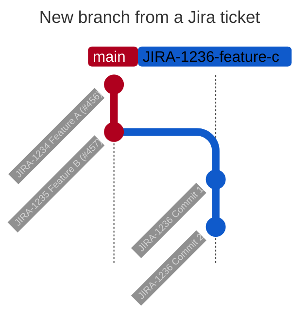
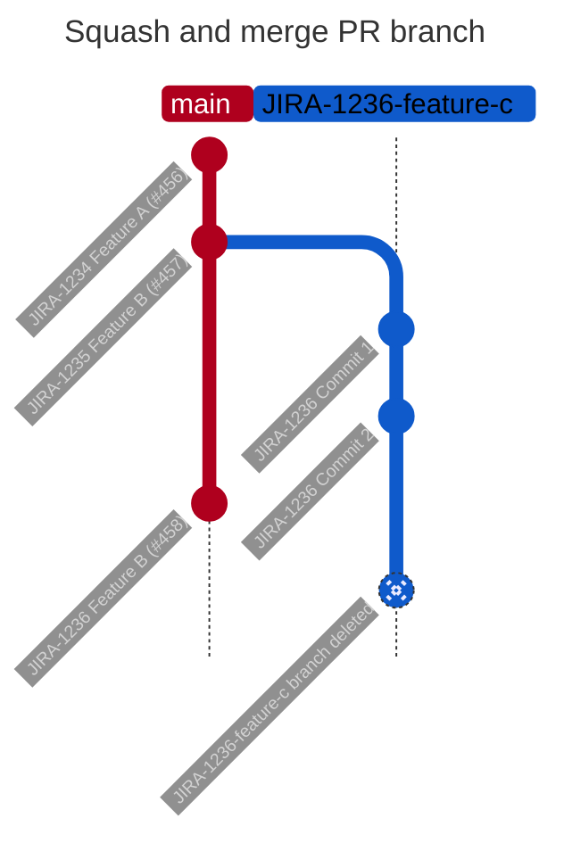
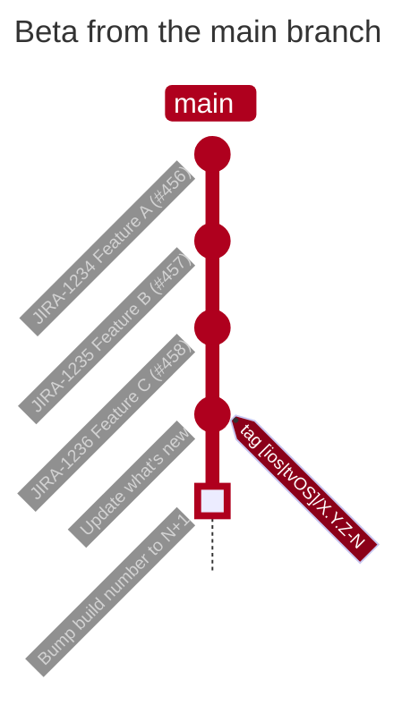
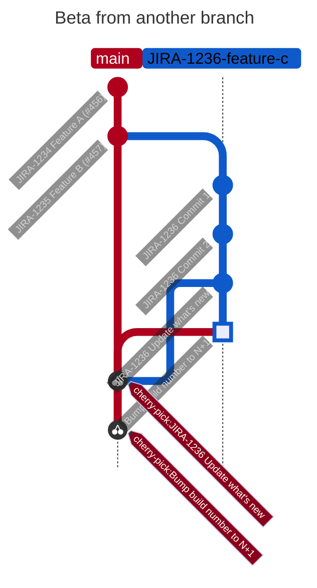

# Workflows

The project implements some workflows. It a mix of:

- Fastlane scripts (needs `make ruby-setup` to setup Ruby).
- Bash scripts (with `make` commands).
- Github actions (running on [github.com](https://github.com/SRGSSR/playsrg-apple)).

# Start a feature or a bug fix

🙏 Please first run one time on the Mac, `make git-hook-install`, so that the `pre-commit` linter and Jira `commit-msg` are installed.

### Start from an internal Jira ticket

1. Create a branch from `main` with this naming convention: `JIRA-1235-feature-b`. Start with the Jira ticket id.
2. Checkout the new branch.
3. Commit your changes with the Jira ticket id in the commit message. `commit-msg` git hook will do it automatically.

ℹ️ The Jira website could help and proposes to create the branch from the ticket page.

### Start from a public Github issue

1. Create a branch from `main` with this naming convention: `1235-feature-b`. Start with the Github issue id.
2. Checkout the new branch.
3. Commit your changes with the Github issue id in the commit message if possible.

ℹ️ The Github website could also help and proposes to create the branch from the issue page.

# Build and distribute Private Nightlies

During the development, non-public builds can be done for internal testers and validate the implementation.

- TestFlight release notes for nightlies are from commit messages. No custom commit needed.
- Build can be done from any branches. 
1. On PlayCity CI select the project:
   - **[Play SRG iOS Nightlies 🌱🌙](https://playcity.eu.ngrok.io/buildConfiguration/playsrgios_NightliesIOS)**: `fastlane ios iOSnightlies`
   - **[Play SRG tvOS Nightlies 🌱🌙](https://playcity.eu.ngrok.io/buildConfiguration/playsrgios_NightliesTvOS)**: `fastlane ios tvOSnightlies`
2. Select the branch.
3. Run the project. Private Nighties builds have:
   - the current version on the repository.
   - a build number incremented from the last one found on AppStore Connect. Build number is not versioned on git.
   - a displayed name containing:
       - "🌙" if built from the `main` branch.
       - "🌱" if built from another branch.
       - the branch name if it's not the `main` branch.
     - then an upload to AppStore Connect and are distributed to the SRG Testers TestFlight group.
     - release notes from commit messages. No additional commits needed.

# Submit to review a feature or a bug fix

When the feature or the bug fix branch is ready to be tested and reviewed:

1. A [pull request](https://github.com/SRGSSR/playsrg-apple/pulls) is opened from the branch to be merged to the `main` branch.
2. Set the Jira ticket id in the PR title and a comprehensive title. Example: `JIRA-1236 Feature C`. The Github PR id will be added during the merge, later.
3. Add [one label](https://github.com/SRGSSR/playsrg-apple/labels) to the PR (used for automatically generated Github release notes, later).
4. Add reviewers to the PR. At least one team member has to review the PR. 
   - Conversations, code propositions, architecture or UI/UX remarks could be added and has to be solved.
5. ✅ When the feature or the bug fix is validated and the PR is reviewed, add the PR to the Github queue.
   - A squash commit is done, added onto the `main` branch after passed tests.
   - The commit message is the PR title and the PR Github id.
   - The PR branch is deleted.

# Build and distribute Private Betas

Before a release and sometime, during the development, non-public **stable** builds can be done for internal testers and validate the feature or the fix.

ℹ️ The Private Betas workflow can be scheduled with the Public Betas workflow on PlayCity CI. If it's plan to build both betas, refer to the next section: [Build and distribute Public Betas and AppStore builds](#Build-and-distribute-Public-Betas-and-AppStore-builds).

- Private Betas will uses the current version (`X.Y.Z`) and the current build number (`N`) in the project.
- TestFlight release notes for betas are custom and need to be commited on the future built branch:
	- `WhatsNew-iOS-beta.json` for iOS platform.
	- `WhatsNew-tvOS-beta.json` for tvOS platform.
	- Can be done in one unique commit with "Update what's new" message.
- Build can be done from any branches, but most of the time, it's on the `main` branch.
- On PlayCity CI, build Private Betas with the current version (`X.Y.Z`) and the current build number (`N`).
	- With projects (select the right branch and check that it's the expected last commit):
		- **[Play SRG iOS Betas 🪴🎯](https://playcity.eu.ngrok.io/buildConfiguration/playsrgios_BetasIOS)**: `fastlane ios iOSbetas`
		- **[Play SRG tvOS Betas 🪴🎯](https://playcity.eu.ngrok.io/buildConfiguration/playsrgios_BetasTvOS)**: `fastlane ios tvOSbetas`
	- If the build is on the `main` branch, the current commit is tagged with `[ios|tvos]/X.Y.Z-N`.
	- The build number (`N`) is incremented after the build success and commited on the current branch with message "Bump build number to N+1".
	- If the build is on another branch, no tags. The latest "Update what's new" and "Bump build number to N+1" commits are cherry picked to the `main` branch.
	- Build displayed name contains:
		- "🎯" if built from the `main` branch.
		- "🪴" if built from another branch.
	- Build name contains the branch name if it's not the `main` branch.
    - The Private Betas are uploaded to AppStore Connect and distributed to the SRG Testers TestFlight group.

# Build and distribute Public Betas and AppStore Builds

For a release and sometime, during the development, external **stable** builds can be done for early adopters, our best testers.

ℹ️ The Public Beta builds are the same builds as the AppStore Builds. Almost, they are based on the same branch and commit as the Private Beta builds and share the same version and same build number.

- AppStore Builds will uses the current version (`X.Y.Z`) and the current build number (`N`) in the project.
- TestFlight release notes for AppStore builds are the same custom ones as the Private Betas and need to be commited on the future built branch:
	- `WhatsNew-iOS-beta.json` for iOS platform.
	- `WhatsNew-tvOS-beta.json` for tvOS platform.
	- Can be done in one unique commit with "Update what's new" message.
- Build can be done from any branches, but most of the time, it's on the `main` branch.
- ⚠️ Never release a build from a feature branch. It must be merged to the `main` branch before.
- On PlayCity CI, build AppStore Builds with the current version (`X.Y.Z`) and the current build number (`N`).
	- With projects (select the right branch and check that it's the expected last commit):
      - **[Play SRG iOS AppStore builds 🌳](https://playcity.eu.ngrok.io/buildConfiguration/playsrgios_TestFlightIOS)**: `fastlane ios iOSAppStoreBuilds`
      - **[Play SRG tvOS AppStore builds 🌳](https://playcity.eu.ngrok.io/buildConfiguration/playsrgios_TestFlightTvOS)**: `fastlane ios tvOSAppStoreBuilds`
    - If the Private Betas are not done in this branch and commit, the PlayCity CI will do the Private Betas before the AppStore Builds.
	- Build displayed name contains:
		- No emoji if built from the `main` branch.
		- "🌳" if built from another branch.
	- Build name contains the branch name if it's not the `main` branch.
    - The AppStore Builds are uploaded to AppStore Connect and distributed to the SRG Testers TestFlight group.
- 🚀 To distribute the Public Betas to the (public) Beta Testers TestFlight group, rerun the projects on the same branch and commit,
  - With projects (select the right branch and check that it's the expected last commit, and check `public_testflight_distribution` parameter):
	- **[Play SRG iOS AppStore builds 🌳](https://playcity.eu.ngrok.io/buildConfiguration/playsrgios_TestFlightIOS)**: `fastlane ios iOSAppStoreBuilds public_testflight_distribution:true`
	- **[Play SRG tvOS AppStore builds 🌳](https://playcity.eu.ngrok.io/buildConfiguration/playsrgios_TestFlightTvOS)**: `fastlane ios tvOSAppStoreBuilds public_testflight_distribution:true`
  - No new builds, only the distribution is done.
  - Not all Beta builds are distributed to the public Beta Testers TestFlight group. It's a team and PO decision.
  - We can follow Apple TestFlight review status locally with `make appstore-testflight-status`.

# Prepare an AppStore release

The AppStore release needs a public and translated what's new AppStore release notes.

On [crowdin.com PlaySRG project](https://crowdin.com/project/play-srg/sources/files), `What_s new iOS.csv` and `What_s new tvOS.csv` files are used to translate the release notes from English to Italian, Romansh, French and German.
	
- Download the csv source files from [crowdin.com](https://crowdin.com/project/play-srg/sources/files).
- Add the new version entry to the csv files, with the English text.
- Upload the updated csv files to crowdin.com.
- Ask the translators ([play-srg-translators@rts.ch](mailto:play-srg-translators@rts.ch)) to translate the new entries.
- On PlayCity CI, prepare the AppStore release with the current version and the current build number.
  - With projects (select the right branch and check that it's the expected last commit):
	  - **[Play SRG iOS AppStore releases](https://playcity.eu.ngrok.io/buildConfiguration/playsrgios_PlaySrgIOSAppStoreReleases)**: `fastlane ios iOSPrepareAppStoreReleases`
	  - **[Play SRG tvOS AppStore releases](https://playcity.eu.ngrok.io/buildConfiguration/playsrgios_PlaySrgTvOSAppStoreReleases)**: `fastlane ios tvOSPrepareAppStoreReleases`
  - A new AppStore release is created on AppStore Connect with the current version if not already existing.
  - The what's new AppStore release notes are updated with the translated release notes from crowdin.com.
  - Basic checks are done with [Fastlane precheck](https://docs.fastlane.tools/actions/precheck/).
  - No submission to Apple review is done for now.

# Update the AppStore screenshots

Optional, update the AppStore screenshots with the latest version of the application.

⚠️ All screenshots Fastlane lanes must be executed from a Swiss IP, to avoid geo-blocking icons on media items.

- On a Mac device, with the latest version of Xcode and Fastlane installed:
	- Checkout the `main` branch.
	- Run the following commands:
      - Screenshots iOS
          - Play RSI iOS: `fastlane ios iOSrsiScreenshots`
          - Play RTR iOS: `fastlane ios iOSrtrScreenshots`
          - Play RTS iOS: `fastlane ios iOSrtsScreenshots` (No upload to ASC, due to some marketing images)
          - Play SRF iOS: `fastlane ios iOSsrfScreenshots` (No upload to ASC, due to some marketing images)
      - Screenshots tvOS
          - Play RSI tvOS: `fastlane ios tvOSrsiScreenshots`
          - Play RTR tvOS: `fastlane ios tvOSrtrScreenshots`
          - Play RTS tvOS: `fastlane ios tvOSrtsScreenshots` (No upload to ASC, due to some marketing images)
          - Play SRF tvOS: `fastlane ios tvOSsrfScreenshots` (No upload to ASC, due to some marketing images)
    - The screenshots are done with UITests scripts.
    - If allowed, the screenshots are uploaded to AppStore Connect and replaced the current ones.
    - The screenshots are not yet submitted to Apple review.
- Locally, the screenshots are in the `"fastlane/export/XxxYyyScreenshots` folder.

# Submit an AppStore release for review

When all is ok:

- The what's new AppStore release notes are translated on crowdin.com.
  - Sometimes, we need to fix returned lines, points po remove a translated line only for a BU application.
  - [Prepare an AppStore release](#Prepare-an-AppStore-release) can be rerun to update the AppStore release notes.
  - We can follow updated translations locally with `make appstore-status`.
- At least, one AppStore build is uploaded to AppStore Connect for this version.
- The AppStore screenshots are updated if needed.
- The AppStore builds are validated by the team and the PO, using the Public Betas builds (named also AppStore builds).

Let's submit the AppStore release for review:

- On PlayCity CI, submit to Apple review the releases with the current version number.
	- With projects (select the right branch and check that it's the expected commit with the tag, AND check `submit_for_review` parameter):
		- **[Play SRG iOS AppStore releases](https://playcity.eu.ngrok.io/buildConfiguration/playsrgios_PlaySrgIOSAppStoreReleases)**: `fastlane ios iOSPrepareAppStoreReleases submit_for_review:true`
		- **[Play SRG tvOS AppStore releases](https://playcity.eu.ngrok.io/buildConfiguration/playsrgios_PlaySrgTvOSAppStoreReleases)**: `fastlane ios tvOSPrepareAppStoreReleases submit_for_review:true`
	- A new AppStore release is created on AppStore Connect with the current version if not already existing.
	- The what's new AppStore release notes are updated with the translated release notes from crowdin.com.
	- Basic checks are done with [Fastlane precheck](https://docs.fastlane.tools/actions/precheck/).
    - The latest build related to the version is submitted to Apple review (highest build number).
	- 🚀 Submission to Apple review is done this time.
- We can follow updated status locally with `make appstore-status`.

# Release notes on Github pages

Play SRG iOS applications have in `Profile` tab, `Settings` view, a `What's new` link.
It downloads a html file to display release notes. The html pages are published on the project Github pages: [https://srgssr.github.io/playsrg-apple](https://srgssr.github.io/playsrg-apple).

Publish release notes on Github pages with correct released status (AppStore and TestFlight release notes):
- On PlayCity CI, prepare the AppStore release with the current version and the current build number.
  - With projects (any branch and commits):
      - **[Play SRG Publish release notes](https://playcity.eu.ngrok.io/buildConfiguration/playsrgios_PlaySrgPublishReleaseNotes)**: `fastlane ios publishReleaseNotes`
  - The script does update automatically (recommended)
  - The script is scheduled to run on CI after build success.

The update can be done manually, without keeping the commits history on the `gh-pages` branch:

- Checkout `gh-pages` branch.
- Edit html files with a new `div` for a new version.
- Add or remove the `preprod` div attribute if it's a prerelease version (used by the javascript script).
- Amend commit with the changes.
- Force push the remote branch.
- Switch back to another branch.
- Remove local `gh-pages` branch (recommended if the fastlane script needs to run later).

# Bump versions

When a release is published on the AppStore, the version number needs to be bumped for the next release.

TDB

- After AppStore validation, finish git-flow release, bump build version numbers, push master, develop and tag.
 	- **Play SRG After AppStore validation GitFlow**: `fastlane ios afterAppStoreValidationGitFlow`
