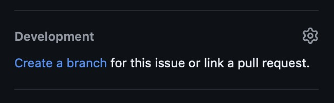

# Workflows

The project implements some workflows. It a mix of:

- Fastlane scripts (needs `make ruby-setup` to setup Ruby).
- Bash scripts (with `make` commands).
- Github actions (running on [github.com](https://github.com/SRGSSR/playsrg-apple)).

# Start a feature or a bug fix

🙏 Please first run one time on the Mac, `make git-hook-install`, so that the `pre-commit` linter and Jira `commit-msg` are installed.

### Start from an internal Jira ticket

1. Create a branch from `main` with this naming convention: `JIRA-1235-feature-b`. Start with the Jira ticket id.
2. Checkout the new branch.
3. Commit your changes with the Jira ticket id in the commit message. `commit-msg` git hook will do it automatically.

ℹ️ The Jira website could help and proposes to create the branch from the ticket page.

### Start from a public Github issue

1. Create a branch from `main` with this naming convention: `1235-feature-b`. Start with the Github issue id.
2. Checkout the new branch.
3. Commit your changes with the Github issue id in the commit message if possible.

ℹ️ The Github website could also help and proposes to create the branch from the issue page.

# Build and distribute Private Nightlies

During the development, non-public builds can be done for internal testers so that they can validate the implementation.

1. On PlayCity CI select the project:
   - **[Play SRG iOS Nightlies 🌱🌙](https://playcity.eu.ngrok.io/buildConfiguration/playsrgios_NightliesIOS)**: `fastlane ios iOSnightlies`
   - **[Play SRG tvOS Nightlies 🌱🌙](https://playcity.eu.ngrok.io/buildConfiguration/playsrgios_NightliesTvOS)**: `fastlane ios tvOSnightlies`
2. Select the branch.
3. Run the project. Private Nighties builds have:
   - the current version (`X.Y.Z`) on the repository.
   - a build number (`N`) incremented from the last one found on App Store Connect. Build number is not versioned on git.
   - a displayed name containing:
       - "🌙" if built from the `main` branch.
       - "🌱" if built from another branch.
       - the branch name if it's not the `main` branch.
     - then an upload to App Store Connect and are distributed to the SRG Testers TestFlight group.
     - TestFlight release notes from commit messages. No additional commits needed.

ℹ️ If running the project on a same commit and branch, new builds are done and distributed.

# Submit to review a feature or a bug fix

When the feature or the bug fix branch is ready to be tested and reviewed:

1. A [pull request](https://github.com/SRGSSR/playsrg-apple/pulls) is opened from the branch to be merged to the `main` branch.
2. Set the Jira ticket id in the PR title and a comprehensive title. Example: `JIRA-1236 Feature C`. The Github PR id will be added during the merge, later.
3. Add [one label](https://github.com/SRGSSR/playsrg-apple/labels) to the PR (used for automatically generated Github release notes, later).
4. Add reviewers to the PR. At least one team member has to review the PR. 
   - Conversations, code propositions, architecture or UI/UX remarks could be added and has to be solved.
5. ✅ When the feature or the bug fix is validated and the PR is reviewed, add the PR to the Github queue.
   - A squash commit is done, added onto the `main` branch after passed tests.
   - The commit message is the PR title and the PR Github id.
   - The PR branch is deleted.

# Build and distribute Private Betas

Before a release and sometime, during the development, non-public **stable** builds can be done for internal testers so that they can validate the feature or the fix.

ℹ️ The Private Betas workflow can be scheduled because of dependency with the Public Betas workflow on PlayCity CI. If it's the plan to build both private and public betas, please refer to the next section: [Build and distribute Public Betas and AppStore builds](#build-and-distribute-public-betas-and-appStore-builds).

1. Commit the release notes for the Betas on the future built branch. Those files are:
    - `WhatsNew-iOS-beta.json` for iOS platform.
    - `WhatsNew-tvOS-beta.json` for tvOS platform.
    - Can be done in one unique commit with "Update what's new" message.
2. Push the commit to the repository.
3. On PlayCity CI select the project:
   - **[Play SRG iOS Betas 🪴🎯](https://playcity.eu.ngrok.io/buildConfiguration/playsrgios_BetasIOS)**: `fastlane ios iOSbetas`
   - **[Play SRG tvOS Betas 🪴🎯](https://playcity.eu.ngrok.io/buildConfiguration/playsrgios_BetasTvOS)**: `fastlane ios tvOSbetas`
4. Select the branch (most of the time, it's the `main` branch).
5. Run the project. Private Betas builds have:
   - the current version (`X.Y.Z`) on the repository.
   - the current build number (`N`) on the repository.
   - a displayed name containing:
       - "🎯" if built from the `main` branch.
       - "🪴" if built from another branch.
       - the branch name if it's not the `main` branch.
     - then an upload to App Store Connect and are distributed to the SRG Testers TestFlight group.
     - TestFlight release notes from the `WhatsNew-iOS-beta.json` and `WhatsNew-tvOS-beta.json` files.
     - Then, the current commit is tagged with `[ios|tvos]/X.Y.Z-N` if the build is on the `main` branch.
     - Then, the build number (`N`) is incremented and commited on the current branch with message "Bump build number to `N`+1".
     - Then, if the build is on another branch, no tags. The latest "Update what's new" and "Bump build number to `N`+1" commits are cherry-picked to the `main` branch.

ℹ️ If running the project on a same commit and branch, no new builds are done, only the distribution is done again.

# Build and distribute Public Betas and AppStore Builds

For a release and sometime, during the development, external **stable** builds can be done for early adopters, our best testers.

ℹ️ The Public Beta builds are named "AppStore Builds" as they are the same builds distributed on the App Store after an Apple review. Almost, they are based on the same branch and commit as the Private Beta builds and share the same version (`X.Y.Z`) and build number (`N`).

- ⚠️ An AppStore Builds must be run a tagged commit, otherwise, the Private Betas workflow will be scheduled before on PlayCity CI.

1. Verify that the release notes for the Betas are commited on the branch. Those files are:
    - `WhatsNew-iOS-beta.json` for iOS platform.
    - `WhatsNew-tvOS-beta.json` for tvOS platform.
2. On PlayCity CI select the project:
    - **[Play SRG iOS AppStore builds 🌳](https://playcity.eu.ngrok.io/buildConfiguration/playsrgios_TestFlightIOS)**: `fastlane ios iOSAppStoreBuilds public_beta_distribution:true`
    - **[Play SRG tvOS AppStore builds 🌳](https://playcity.eu.ngrok.io/buildConfiguration/playsrgios_TestFlightTvOS)**: `fastlane ios tvOSAppStoreBuilds public_beta_distribution:true`
3. Select the branch (most of the time, it's the `main` branch).
4. Select the commit with the tag (or future tag).
5. (optional) Unselect the `public_beta_distribution` parameter only if you want to keep the build not distributed to the public Beta Testers TestFlight group. It must be rerun with the parameter to distribute it later. Never forget early adopters.
6. Run the project. AppStore Builds have:
   - the current version (`X.Y.Z`) on the repository.
   - the current build number (`N`) on the repository.
   - a displayed name containing:
       - No emoji if built from the `main` branch.
       - "🌳" if built from another branch.
       - the branch name if it's not the `main` branch.
   - then an upload to App Store Connect and are distributed to the SRG Testers TestFlight group.
   - also a distribution to the Public Beta Testers TestFlight group if no `public_beta_distribution` parameter set or set it to `true`.
   - TestFlight release notes from the `WhatsNew-iOS-beta.json` and `WhatsNew-tvOS-beta.json` files.
7. We can follow the Apple TestFlight review status locally with `make appstore-testflight-status`.

ℹ️ If running the project on a same commit and branch, no new builds are done, only the distribution is done again.

# Prepare an App Store release

🙋**It's recommended to have the markdown [release checklist](RELEASE_CHECKLIST.md) in a shared Jira ticket or github issue to follow steps.** 

ℹ️ The App Store release needs a public and translated what's new App Store release notes.

On [crowdin.com PlaySRG project](https://crowdin.com/project/play-srg/sources/files), `What_s new iOS.csv` and `What_s new tvOS.csv` files are used to translate the release notes from English to Italian, Romansh, French and German.
	
1. Download the csv source files from [crowdin.com](https://crowdin.com/project/play-srg/sources/files).
2. Add the new version entry to the csv files, with the English text.
3. Upload the updated csv files to crowdin.com.
4. Ask the translators ([play-srg-translators@rts.ch](mailto:play-srg-translators@rts.ch)) to translate the new entries.
5. On PlayCity CI select the project:
    - **[Play SRG iOS AppStore releases](https://playcity.eu.ngrok.io/buildConfiguration/playsrgios_PlaySrgIOSAppStoreReleases)**: `fastlane ios iOSPrepareAppStoreReleases`
    - **[Play SRG tvOS AppStore releases](https://playcity.eu.ngrok.io/buildConfiguration/playsrgios_PlaySrgTvOSAppStoreReleases)**: `fastlane ios tvOSPrepareAppStoreReleases`
6. Select the commit with the tag.
7. Run the project. The script:
   - Creates a new App Store release on App Store Connect with the current version if not already existing.
   - Sets the translated what's new for this version.
   - Updates the what's new App Store release notes with the translated release notes from crowdin.com.
   - Does basic checks with [Fastlane precheck](https://docs.fastlane.tools/actions/precheck/).
   - No submission to Apple review is done for now.
8. We can follow Apple release status and what's new release notes locally with `make appstore-status`.

ℹ️ The project can be rerun to update the translated App Store release notes if needed.

# Update the App Store screenshots

Optional, update the App Store screenshots with the latest version of the application.

⚠️ **All screenshots Fastlane lanes must be executed from a Swiss IP, to avoid geo-blocking icons on media items.**

On a Mac device, with the latest version of Xcode and Fastlane installed:

1. Checkout the `main` branch.
2. Run the following commands:
   - Screenshots iOS:
       - Play RSI iOS: `fastlane ios iOSrsiScreenshots`
       - Play RTR iOS: `fastlane ios iOSrtrScreenshots`
       - Play RTS iOS: `fastlane ios iOSrtsScreenshots` (No upload to ASC, due to some marketing images)
       - Play SRF iOS: `fastlane ios iOSsrfScreenshots` (No upload to ASC, due to some marketing images)
   - Screenshots tvOS:
       - Play RSI tvOS: `fastlane ios tvOSrsiScreenshots`
       - Play RTR tvOS: `fastlane ios tvOSrtrScreenshots`
       - Play RTS tvOS: `fastlane ios tvOSrtsScreenshots` (No upload to ASC, due to some marketing images)
       - Play SRF tvOS: `fastlane ios tvOSsrfScreenshots` (No upload to ASC, due to some marketing images)
   - The screenshots are done with UITests scripts.
   - If allowed, the screenshots are uploaded to App Store Connect and replaced the current ones.
   - The screenshots are not yet submitted to Apple review.

ℹ️ Locally, the screenshots are in the `"fastlane/export/XxxYyyScreenshots` folder.

# Submit an App Store release for review

🙋**It's recommended to have the markdown [release checklist](RELEASE_CHECKLIST.md) in a shared Jira ticket or github issue to follow steps.** 

⚠️ **Never release a build from a feature branch. It must be merged to the `main` branch before.**

When all is ok:

- The what's new App Store release notes are translated on crowdin.com.
  - Sometimes, we need to fix returned lines, points po remove a translated line only for a BU application.
  - [Prepare an App Store release](#prepare-an-app-store-release) can be rerun to update the App Store release notes.
  - We can follow updated translations locally with `make appstore-status`.
- At least, one AppStore build is uploaded to App Store Connect for this version.
- The App Store screenshots are updated if needed.
- The App Store builds are validated by the team and the PO, using the Public Betas builds (named also AppStore builds).

Let's submit the App Store release for review:

1. Check translations locally with `make appstore-status`.
2. On PlayCity CI select the project:
   - **[Play SRG iOS AppStore releases](https://playcity.eu.ngrok.io/buildConfiguration/playsrgios_PlaySrgIOSAppStoreReleases)**: `fastlane ios iOSPrepareAppStoreReleases submit_for_review:true`
   - **[Play SRG tvOS AppStore releases](https://playcity.eu.ngrok.io/buildConfiguration/playsrgios_PlaySrgTvOSAppStoreReleases)**: `fastlane ios tvOSPrepareAppStoreReleases submit_for_review:true`
3. Select the commit with the tag.
4. Check the `submit_for_review` parameter.
5. Run the project. The script:
   - Creates a new App Store release on App Store Connect with the current version if not already existing.
   - Sets the translated what's new for this version.
   - Updates the what's new App Store release notes with the translated release notes from crowdin.com.
   - Does basic checks with [Fastlane precheck](https://docs.fastlane.tools/actions/precheck/).
   - The latest build related to the version is submitted to Apple review (highest build number).
   - 🚀 Submission to Apple review is done this time.
6. We can follow Apple release status and what's new release notes locally with `make appstore-status`.

# Release notes on Github pages

Play SRG iOS applications have in `Profile` tab, `Settings` view, a `What's new` link.
It downloads a html file to display release notes. The html pages are published on the project Github pages: [https://srgssr.github.io/playsrg-apple](https://srgssr.github.io/playsrg-apple).

Publish release notes on Github pages with correct released status (App Store and TestFlight release notes):

ℹ️ The script is scheduled to run on CI after a private or public beta build success.

1. On PlayCity CI select the project:
   - **[Play SRG Publish release notes](https://playcity.eu.ngrok.io/buildConfiguration/playsrgios_PlaySrgPublishReleaseNotes)**: `fastlane ios publishReleaseNotes`
2. Run the project. The script:
     - Does the `gh-pages` branch update automatically.
     - Can be from any branch. No dependency with versions or build numbers.

The update can be done manually (not recommended), without keeping the commits history on the `gh-pages` branch:

- Checkout `gh-pages` branch.
- Edit html files with a new `div` for a new version.
- Add or remove the `preprod` div attribute if it's a prerelease version (used by the javascript script).
- Amend commit with the changes.
- Force push the remote branch.
- Switch back to another branch.
- Remove local `gh-pages` branch (recommended if the fastlane script needs to run later).

# Bump versions

When a release is published on the App Store, the version number (`X.Y.Z`) needs to be bumped for the next release.

ℹ️ The script is scheduled to run on CI automatically.

1. On PlayCity CI select the project:
 	- **Play SRG After AppStore validation**: `fastlane ios afterAppStoreValidation`
2. Select the `main` branch (should be already selected).
3. Run the project. The script:
	- Get AppStore live versions.
	- If one live version is same as the current marketing version, the script:
		- Bumps the patch number of version number (`X.Y.Z`) on the repository.
		- Commits the version bump with message "Bump version to `X.Y.Z+1`".
		- Pushes the commit to the repository.
		- Runs `fastlane ios publishReleaseNotes` if a marketing version as been bumped.

